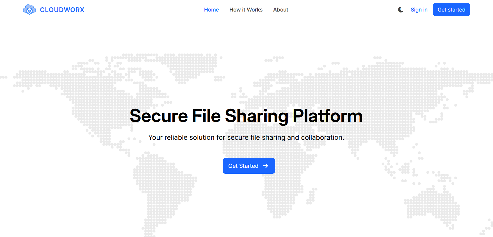

# CloudWorx-WApp
[](https://www.javascript.com)
[](https://sass-lang.com)

HTML/JS web client for [CloudWorx](https://github.com/Nanda128/CloudWorx-Backend) project.

<p align="center">
    
    <br />
    <em>CloudWorx Website Home Page</em>
</p>

## 📋 Quick Start

1. **Clone the repository**
2. **Set up environment**:
    - Copy `.env.example` to `.env`
    - Update with valid RECAPTCHA key (contact [darragh0](https://github.com/darragh0))
3. **Follow [Automated Setup](#automated-setup-recommended) or [Manual Setup](#manual-setup) steps**

> [!NOTE]
> You may see a security warning in your browser the first time you run the app. This is expected with local certificates and can safely be ignored.

## 🔧 Setup Options

### Automated Setup (Recommended)

Use [`init-scripts/init.sh`](./init-scripts/init.sh) (Linux/macOS) or [`init-scripts/init.ps1`](./init-scripts/init.ps1) (Windows) to automatically:

- Configure environment
- Install dependencies
- Generate certificates
- Start the server & open the app in your browser

> [!Note]
> The script will exit with an error if the RECAPTCHA_SECRET_KEY is missing or invalid.

#### Linux and macOS
```sh
chmod +x init-scripts/init.sh && ./init-scripts/init.sh
```

#### Windows
```powershell
.\init-scripts\init.ps1
```

> [!TIP]
> The script will automatically request administrator privileges if needed.

### Manual Setup

If you prefer to set up the project manually, follow these steps (assuming you have [Node.js](https://nodejs.org/en) installed):

#### 1. SSL Certificate Setup
Generate local SSL certificates using [mkcert](https://github.com/FiloSottile/mkcert):

**Install mkcert**:
- Windows (with Chocolatey): `choco install mkcert`
- macOS (with Homebrew): `brew install mkcert nss`
- Linux (Debian/Ubuntu): `sudo apt install libnss3-tools` and download mkcert

**Generate certificates**:
```sh
mkcert -install
mkdir certs && mkcert -key-file certs/localhost-key.pem -cert-file certs/localhost.pem localhost
```

#### 2. Run the Application
```sh
npm install && npm run serve
```

Then open [https://localhost:3443](https://localhost:3443) in your browser.

## 🔒 Why HTTPS?

This application requires [Web Crypto API](https://developer.mozilla.org/en-US/docs/Web/API/Web_Crypto_API) features like `crypto.subtle`, which only work in secure contexts (HTTPS).
