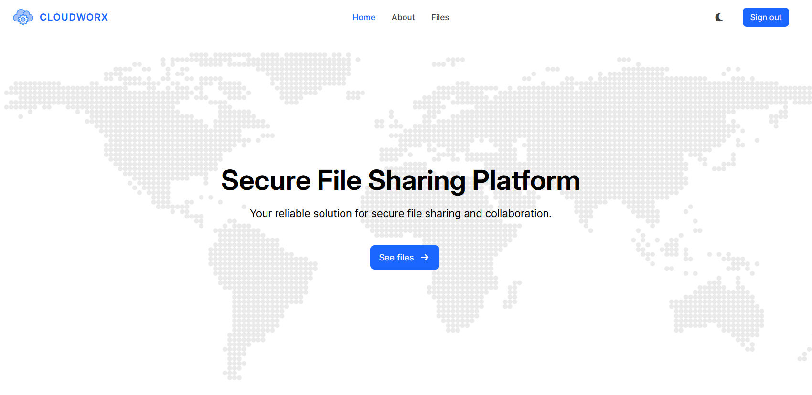

# CloudWorx-WApp

[![CloudWorx](https://img.shields.io/badge/CloudWorx-white.svg?logo=data:image/svg+xml;base64,PD94bWwgdmVyc2lvbj0iMS4wIiBlbmNvZGluZz0iVVRGLTgiPz4KPHN2ZyB2ZXJzaW9uPSIxLjEiIHhtbG5zPSJodHRwOi8vd3d3LnczLm9yZy8yMDAwL3N2ZyIgd2lkdGg9IjUxMiIgaGVpZ2h0PSI1MTIiPgo8cGF0aCBkPSJNMCAwIEMxMC44MDIwODE3NCA4LjE2MzEwODU1IDE5LjU3NDAwNTYxIDE3LjE1OTk3MzI3IDI3LjI1MzkwNjI1IDI4LjM1NTQ2ODc1IEMyOC4zMDQ0OTIxOSAyNy45NDU1NDY4NyAyOS4zNTUwNzgxMiAyNy41MzU2MjUgMzAuNDM3NSAyNy4xMTMyODEyNSBDMzEuODU1MzQxNzkgMjYuNTY4Njc5NzcgMzMuMjczMzE3ODQgMjYuMDI0NDI3NzMgMzQuNjkxNDA2MjUgMjUuNDgwNDY4NzUgQzM1LjM3OTEyMTA5IDI1LjIxMTA1NDY5IDM2LjA2NjgzNTk0IDI0Ljk0MTY0MDYyIDM2Ljc3NTM5MDYyIDI0LjY2NDA2MjUgQzU1Ljk4NTA0NzkxIDE3LjMzNzU4ODU2IDc4LjYzNzE2MzMxIDE3Ljg0NTA5MzY1IDk3LjM5NDUzMTI1IDI2LjE1NjI1IEMxMDUuMDYyMTI5NzYgMjkuNzE4MzE0MTQgMTExLjg0MjAyMzkzIDMzLjgwMjkxMDg3IDExOC4yNTM5MDYyNSAzOS4zNTU0Njg3NSBDMTE5LjA0NjY3OTY5IDM5Ljk1MjMwNDY5IDExOS44Mzk0NTMxMiA0MC41NDkxNDA2MyAxMjAuNjU2MjUgNDEuMTY0MDYyNSBDMTM0LjIwNjk2MDMxIDUyLjU5NTU2Mzk4IDE0Mi4yMzk1NTAyNiA3MC4xNjQ1MDUyMiAxNDUuMjUzOTA2MjUgODcuMzU1NDY4NzUgQzE0NS41MjUxMTI1IDkxLjcxNjk5ODc2IDE0NS41MTg2MzE5IDk1Ljk5NDg0OTA2IDE0NS4yNTM5MDYyNSAxMDAuMzU1NDY4NzUgQzE0Ni40MDg5MDYyNSAxMDAuNDE3MzQzNzUgMTQ3LjU2MzkwNjI1IDEwMC40NzkyMTg3NSAxNDguNzUzOTA2MjUgMTAwLjU0Mjk2ODc1IEMxNzAuNTE2NjU0NTcgMTAzLjAzNjk3Mjg3IDE5MS4xMDM5MzAxOSAxMTUuMDcwOTI0NDcgMjA1LjE2Nzk2ODc1IDEzMS42NDQ1MzEyNSBDMjE4LjUxNDMxNDEzIDE0OC45ODk3ODE2MiAyMjUuODc3NjY2NDcgMTY3Ljg1ODMyOTk0IDIyNS43NTM5MDYyNSAxODkuOTgwNDY4NzUgQzIyNS43NDc0NjA5NCAxOTEuMTk5NTk5NjEgMjI1Ljc0MTAxNTYyIDE5Mi40MTg3MzA0NyAyMjUuNzM0Mzc1IDE5My42NzQ4MDQ2OSBDMjI1LjMxMzU3MjQgMjE0LjY3NjE3NjM3IDIxOC4yNDE5NzAxMyAyMzMuNTk3NDg2NTggMjA0LjI1MzkwNjI1IDI0OS4zNTU0Njg3NSBDMjAzLjcyNTM5MDYyIDI1MC4wMjU3ODEyNSAyMDMuMTk2ODc1IDI1MC42OTYwOTM3NSAyMDIuNjUyMzQzNzUgMjUxLjM4NjcxODc1IEMxODkuNjY5OTk5NDQgMjY3LjUwMjczMjM3IDE2OS4zNjk1ODI5OCAyNzcuMDY2MTkwNCAxNDkuMjUzOTA2MjUgMjgwLjM1NTQ2ODc1IEMxNDEuNTM4Njk3NzQgMjgxLjA2MDg1OTcyIDEzMy44MDE4MjMxOCAyODAuODM3MzEwOCAxMjYuMDY2NDA2MjUgMjgwLjY2Nzk2ODc1IEMxMjQuMDMzMjMxMTcgMjgwLjY0MjgwMzY4IDEyMi4wMDAwMjUzOSAyODAuNjIwMDA1MyAxMTkuOTY2Nzk2ODggMjgwLjU5OTYwOTM4IEMxMTUuMDYxNzE4NzggMjgwLjU0NTM4MTU2IDExMC4xNTgxNjg1MiAyODAuNDU5NTgzMDEgMTA1LjI1MzkwNjI1IDI4MC4zNTU0Njg3NSBDMTA0Ljk2NjA0MjQ4IDI4MS4yODU0MDY0OSAxMDQuOTY2MDQyNDggMjgxLjI4NTQwNjQ5IDEwNC42NzIzNjMyOCAyODIuMjM0MTMwODYgQzEwNC40MTMxMDA1OSAyODMuMDQ2MzIwOCAxMDQuMTUzODM3ODkgMjgzLjg1ODUxMDc0IDEwMy44ODY3MTg3NSAyODQuNjk1MzEyNSBDMTAzLjYzMjkzNDU3IDI4NS41MDA4OTYgMTAzLjM3OTE1MDM5IDI4Ni4zMDY0Nzk0OSAxMDMuMTE3Njc1NzggMjg3LjEzNjQ3NDYxIEMxMDEuODE1MDA3MDEgMjkwLjQ4Mjk4NTc3IDEwMC40NTgwMDQ0NSAyOTEuNzUzNDE5NjUgOTcuMjUzOTA2MjUgMjkzLjM1NTQ2ODc1IEM5MS4wNzQxNTIzMiAyOTMuOTIyNDI1ODkgODQuODIzNTc1ODUgMjkzLjEwMjQzMjYyIDc4LjY5MTQwNjI1IDI5Mi4zNTU0Njg3NSBDNzcuNDY0NTQxMDIgMjkyLjIxMjM4MjgxIDc3LjQ2NDU0MTAyIDI5Mi4yMTIzODI4MSA3Ni4yMTI4OTA2MiAyOTIuMDY2NDA2MjUgQzc0LjIyNjAxOTUgMjkxLjgzNDAyMzY2IDcyLjIzOTg3ODMxIDI5MS41OTU0MTM1OSA3MC4yNTM5MDYyNSAyOTEuMzU1NDY4NzUgQzY5LjE3MjUxNTYgMjk1LjI0OTQ5ODQ4IDY5LjIyODEwMzU4IDI5Ny4xNDE0OTcyIDcxLjE2MDE1NjI1IDMwMC42ODM1OTM3NSBDNzEuNTczOTQ1MzEgMzAxLjQ4NDEwMTU2IDcxLjk4NzczNDM4IDMwMi4yODQ2MDkzOCA3Mi40MTQwNjI1IDMwMy4xMDkzNzUgQzczLjMwMDc4NzQ2IDMwNC43NjEzMjAzMyA3NC4xOTM5MzQ3OSAzMDYuNDA5ODM1OCA3NS4wOTM3NSAzMDguMDU0Njg3NSBDNzcuNzAyNTAyNTcgMzEzLjEzNDAzNDQxIDc4LjcxNTcwNDk2IDMxNi43MTM0MjA3IDc3LjkyMzgyODEyIDMyMi40MDYwMDU4NiBDNzYuNDYxMDgzNjUgMzI2LjY2MjU3MDk3IDcyLjc5MjQ2MjMzIDMyOC44NDExMDM4IDY5LjI1MzkwNjI1IDMzMS4zNTU0Njg3NSBDNjcuODk4Mzc4NTcgMzMyLjM0MjM2Njk3IDY2LjU0MjkxNTUgMzMzLjMyOTM1Mzk2IDY1LjE4NzUgMzM0LjMxNjQwNjI1IEM0Ny42MjM5Nzk0MSAzNDYuOTY4NTE4MDMgNDcuNjIzOTc5NDEgMzQ2Ljk2ODUxODAzIDQyLjE5MTQwNjI1IDM0Ny44NTU0Njg3NSBDMzQuNzcwMjMzMjEgMzQ2LjU5MjI5MDM2IDI5Ljg2MTM2MzYxIDM0MC4wNjgzMjI3NiAyNS4wMjE0ODQzOCAzMzQuNzgxMjUgQzI0LjQ3ODE0NDUzIDMzNC4yMTI3NzM0NCAyMy45MzQ4MDQ2OSAzMzMuNjQ0Mjk2ODggMjMuMzc1IDMzMy4wNTg1OTM3NSBDMjIuODk0NzQzNjUgMzMyLjUzOTQyMzgzIDIyLjQxNDQ4NzMgMzMyLjAyMDI1MzkxIDIxLjkxOTY3NzczIDMzMS40ODUzNTE1NiBDMTkuNjUwMDE1MzQgMzI5Ljk0NTg1MzE3IDE3LjkzMzQxNzU0IDMzMC4xNTkwNjc3NSAxNS4yNTM5MDYyNSAzMzAuMzU1NDY4NzUgQzE1LjE0ODQ0NDgyIDMzMS4wMjYwMjI5NSAxNS4wNDI5ODM0IDMzMS42OTY1NzcxNSAxNC45MzQzMjYxNyAzMzIuMzg3NDUxMTcgQzE0LjQ0NzY4NjU2IDMzNS40NDExNjA5MiAxMy45NDQ3MjEyIDMzOC40OTE5NjUwMyAxMy40NDE0MDYyNSAzNDEuNTQyOTY4NzUgQzEzLjE5MjkzOTQ1IDM0My4xMjU2MTUyMyAxMy4xOTI5Mzk0NSAzNDMuMTI1NjE1MjMgMTIuOTM5NDUzMTIgMzQ0Ljc0MDIzNDM4IEMxMi43Njg2NTIzNCAzNDUuNzYxODE2NDEgMTIuNTk3ODUxNTYgMzQ2Ljc4MzM5ODQ0IDEyLjQyMTg3NSAzNDcuODM1OTM3NSBDMTIuMTk0MDczNDkgMzQ5LjI0MjAyMjcxIDEyLjE5NDA3MzQ5IDM0OS4yNDIwMjI3MSAxMS45NjE2Njk5MiAzNTAuNjc2NTEzNjcgQzEwLjc2NjUwOTY2IDM1NS4yMDAzMTI3NiA5LjE1MDAwMjc5IDM1Ny43NTgwNzEwNiA1LjI1MzkwNjI1IDM2MC4zNTU0Njg3NSBDMi4yNjY4NDY3IDM2MC41NzYxMTQzNyAtMC42MjQ1ODgyMSAzNjAuNjgzNTIyOTYgLTMuNjEzMjgxMjUgMzYwLjY5MTQwNjI1IEMtNC40ODUwMTk4NCAzNjAuNjk4MDYzMDUgLTUuMzU2NzU4NDIgMzYwLjcwNDcxOTg1IC02LjI1NDkxMzMzIDM2MC43MTE1NzgzNyBDLTguMDk5MTE5OTggMzYwLjcyMTcwMjY1IC05Ljk0MzM2MzI1IDM2MC43MjYzOTU0NiAtMTEuNzg3NTk3NjYgMzYwLjcyNjA3NDIyIEMtMTQuNjAzODA3NSAzNjAuNzMwNDQxOTQgLTE3LjQxODQ0MzA1IDM2MC43NjY3NDc1NiAtMjAuMjM0Mzc1IDM2MC44MDQ2ODc1IEMtMjIuMDI3MzM4NCAzNjAuODEwNTU2ODcgLTIzLjgyMDMwOTIzIDM2MC44MTQ1MjU0NiAtMjUuNjEzMjgxMjUgMzYwLjgxNjQwNjI1IEMtMjYuODcyODgxNjIgMzYwLjgzNzk2MjggLTI2Ljg3Mjg4MTYyIDM2MC44Mzc5NjI4IC0yOC4xNTc5Mjg0NyAzNjAuODU5OTU0ODMgQy0zMi4wNTQzNTM0OSAzNjAuODI5NjM1MzYgLTM0LjI2NzkzMjM2IDM2MC42MjU4NzU2NCAtMzcuNzE4MDE3NTggMzU4LjY3NDgwNDY5IEMtNDAuMDY1MjM0MzQgMzU1Ljk5MDQ5NTE2IC00MC42NzA3NjkxIDM1NC4yNzA0NDI4IC00MS4zMjgxMjUgMzUwLjc4NTE1NjI1IEMtNDEuNTM3NTk3NjYgMzQ5LjcyNDI1NzgxIC00MS43NDcwNzAzMSAzNDguNjYzMzU5MzggLTQxLjk2Mjg5MDYyIDM0Ny41NzAzMTI1IEMtNDIuMTU5NDcyNjYgMzQ2LjQ2ODE2NDA2IC00Mi4zNTYwNTQ2OSAzNDUuMzY2MDE1NjIgLTQyLjU1ODU5Mzc1IDM0NC4yMzA0Njg3NSBDLTQyLjg4MjQ3MDcgMzQyLjU2NTY0NDUzIC00Mi44ODI0NzA3IDM0Mi41NjU2NDQ1MyAtNDMuMjEyODkwNjIgMzQwLjg2NzE4NzUgQy00NC43NDYwOTM3NSAzMzIuODc1MDYyIC00NC43NDYwOTM3NSAzMzIuODc1MDYyIC00NC43NDYwOTM3NSAzMzAuMzU1NDY4NzUgQy00Ny42NDU5MTE2MSAzMzAuMDk5NDY1MDcgLTQ5LjIxNDk1NDM3IDMyOS45NzU2NDAzMyAtNTEuNjI3MTk3MjcgMzMxLjcwMDY4MzU5IEMtNTIuMjAzOTcyMTcgMzMyLjMxNjM3MjA3IC01Mi43ODA3NDcwNyAzMzIuOTMyMDYwNTUgLTUzLjM3NSAzMzMuNTY2NDA2MjUgQy01NC4wMTc1OTc2NiAzMzQuMjM0MTQwNjMgLTU0LjY2MDE5NTMxIDMzNC45MDE4NzUgLTU1LjMyMjI2NTYyIDMzNS41ODk4NDM3NSBDLTU2LjMwNTQ5ODA1IDMzNi42NDk0NTMxMiAtNTYuMzA1NDk4MDUgMzM2LjY0OTQ1MzEyIC01Ny4zMDg1OTM3NSAzMzcuNzMwNDY4NzUgQy01OC42MTc3NDYxOCAzMzkuMTE3Njg0MDMgLTU5LjkzMTM5ODUyIDM0MC41MDA2Njk1MyAtNjEuMjUgMzQxLjg3ODkwNjI1IEMtNjEuODI1NjQ2OTcgMzQyLjQ5Njg1MDU5IC02Mi40MDEyOTM5NSAzNDMuMTE0Nzk0OTIgLTYyLjk5NDM4NDc3IDM0My43NTE0NjQ4NCBDLTY1LjQyMTc4NDE1IDM0NS45NzQxODQ1NiAtNjcuNDY5NDE1NzUgMzQ3LjIyMzQzMDQ1IC03MC43NzE0ODQzOCAzNDcuNTY0OTQxNDEgQy03Ny43MTA5MDIzOSAzNDcuMDA5OTc4NzggLTgxLjg5NDAyNjQ5IDM0My45ODI0MzczNiAtODcuMjQ2MDkzNzUgMzM5LjczMDQ2ODc1IEMtODguMDM2Mjg5MDYgMzM5LjEyNTg5ODQ0IC04OC44MjY0ODQzOCAzMzguNTIxMzI4MTMgLTg5LjY0MDYyNSAzMzcuODk4NDM3NSBDLTkxLjIyNjkxNDY3IDMzNi42ODA4MTA5IC05Mi44MDUxNjA0MyAzMzUuNDUyNjI5OTQgLTk0LjM3NSAzMzQuMjEzODY3MTkgQy05NS45OTE5MTUzMiAzMzIuOTQ2NTczMTggLTk3LjYyNTY3MDI1IDMzMS43MDA1NDQ1MiAtOTkuMjczNDM3NSAzMzAuNDczNjMyODEgQy0xMDAuMDc5MTAxNTYgMzI5Ljg3MDAyOTMgLTEwMC44ODQ3NjU2MiAzMjkuMjY2NDI1NzggLTEwMS43MTQ4NDM3NSAzMjguNjQ0NTMxMjUgQy0xMDIuNDQxMjMwNDcgMzI4LjEwNzc5Nzg1IC0xMDMuMTY3NjE3MTkgMzI3LjU3MTA2NDQ1IC0xMDMuOTE2MDE1NjIgMzI3LjAxODA2NjQxIEMtMTA2LjY1Mjk2Mzg0IDMyNC41MzE1OTEzMSAtMTA3LjU5NjQyNTc2IDMyMi4zMjMzMjE3NCAtMTA4LjE1NjI1IDMxOC43MDMxMjUgQy0xMDcuNDU4NTc5NDggMzEzLjAwODgwNDY1IC0xMDQuNDg4MzM4NiAzMDguMjg5MDg1OTIgLTEwMS44NTc0MjE4OCAzMDMuMjU1ODU5MzggQy0xMDEuNDQ4MTQ0NTMgMzAyLjQ0MTgxNjQxIC0xMDEuMDM4ODY3MTkgMzAxLjYyNzc3MzQ0IC0xMDAuNjE3MTg3NSAzMDAuNzg5MDYyNSBDLTEwMC4yMzQ4OTk5IDMwMC4wNTc0Mzg5NiAtOTkuODUyNjEyMyAyOTkuMzI1ODE1NDMgLTk5LjQ1ODc0MDIzIDI5OC41NzIwMjE0OCBDLTk4LjU3NjEwNTg2IDI5NS44MjY3NTM0MSAtOTguOTg0NjkwODIgMjk0LjA5ODg2OTUgLTk5Ljc0NjA5Mzc1IDI5MS4zNTU0Njg3NSBDLTEwMC45NDEwNTQ2OSAyOTEuNDk5ODQzNzUgLTEwMi4xMzYwMTU2MiAyOTEuNjQ0MjE4NzUgLTEwMy4zNjcxODc1IDI5MS43OTI5Njg3NSBDLTEwNC45NzI2MjQ2NCAyOTEuOTgwNzM5MTggLTEwNi41NzgwOTUyMyAyOTIuMTY4MjIzODUgLTEwOC4xODM1OTM3NSAyOTIuMzU1NDY4NzUgQy0xMDkuMzU4MjUxOTUgMjkyLjQ5ODU1NDY5IC0xMDkuMzU4MjUxOTUgMjkyLjQ5ODU1NDY5IC0xMTAuNTU2NjQwNjIgMjkyLjY0NDUzMTI1IEMtMTI1LjA4OTc5NTExIDI5NC4zMTkxMzM0MSAtMTI1LjA4OTc5NTExIDI5NC4zMTkxMzM0MSAtMTMwLjE4MzU5Mzc1IDI5MS4zNTU0Njg3NSBDLTEzMy4zNzk2NjEgMjg3LjYxMzczMTQ5IC0xMzMuNzAwMTY5NjEgMjg1LjEwMzQ3Nzg1IC0xMzQuNzQ2MDkzNzUgMjgwLjM1NTQ2ODc1IEMtMTM2LjU5NjE4MDQyIDI4MC4zOTQ3NDQ4NyAtMTM2LjU5NjE4MDQyIDI4MC4zOTQ3NDQ4NyAtMTM4LjQ4MzY0MjU4IDI4MC40MzQ4MTQ0NSBDLTE0My4xNTU5NzY1MSAyODAuNTI2ODE3MjIgLTE0Ny44MjgyMzQ2NyAyODAuNTgzMjUwODQgLTE1Mi41MDEyMjA3IDI4MC42MzAxMjY5NSBDLTE1NC41MDU1OTAzNyAyODAuNjU0OTM1NDkgLTE1Ni41MDk4NzI5OCAyODAuNjg4NzkzOTUgLTE1OC41MTM5MTYwMiAyODAuNzMyNjY2MDIgQy0xODYuNjkzMjkyMTEgMjgxLjMzMzEyOTAzIC0yMDkuNzY5Nzk2NjkgMjczLjQ3OTY3ODM0IC0yMzAuMzAwNzgxMjUgMjUzLjkyMTg3NSBDLTI0Ni43MjcyODM5MSAyMzYuNjE0MzY2MTUgLTI1NS4zNzkzMjYyNSAyMTQuNTQ1Nzc3NjkgLTI1NS4yNDYwOTM3NSAxOTAuNzMwNDY4NzUgQy0yNTUuMjM5NjQ4NDQgMTg5LjUxMTMzNzg5IC0yNTUuMjMzMjAzMTIgMTg4LjI5MjIwNzAzIC0yNTUuMjI2NTYyNSAxODcuMDM2MTMyODEgQy0yNTQuODA1NzU5OSAxNjYuMDM0NzYxMTMgLTI0Ny43MzQxNTc2MyAxNDcuMTEzNDUwOTIgLTIzMy43NDYwOTM3NSAxMzEuMzU1NDY4NzUgQy0yMzIuOTUzMzIwMzEgMTMwLjM1IC0yMzIuOTUzMzIwMzEgMTMwLjM1IC0yMzIuMTQ0NTMxMjUgMTI5LjMyNDIxODc1IEMtMjE5LjEwNjQ3MTQ2IDExMy4xMzkwNDEwOCAtMTk4Ljg5ODc3NTA2IDEwMy43OTY5MTEwNiAtMTc4Ljc0NjA5Mzc1IDEwMC4zNTU0Njg3NSBDLTE3Ny40MjYwOTM3NSAxMDAuMzU1NDY4NzUgLTE3Ni4xMDYwOTM3NSAxMDAuMzU1NDY4NzUgLTE3NC43NDYwOTM3NSAxMDAuMzU1NDY4NzUgQy0xNzQuNzY3MDQxMDIgOTkuNjkyNDA3MjMgLTE3NC43ODc5ODgyOCA5OS4wMjkzNDU3IC0xNzQuODA5NTcwMzEgOTguMzQ2MTkxNDEgQy0xNzUuNjA4NTg5NzQgNjkuMDcwNzI2NTQgLTE2OS42MDMyNDQzNCA0MS44NjAyMzk0MiAtMTQ5Ljc0NjA5Mzc1IDE5LjM1NTQ2ODc1IEMtMTQ4LjcxNTQ4ODI4IDE4LjEyNzYzNjcyIC0xNDguNzE1NDg4MjggMTguMTI3NjM2NzIgLTE0Ny42NjQwNjI1IDE2Ljg3NSBDLTExMS41MTI0Nzk4NSAtMjUuMTM5MDAxNDYgLTQ0Ljg4ODk3MjcxIC0zMi41ODc3MjQyMyAwIDAgWiAiIGZpbGw9IiM0MThDRkQiIHRyYW5zZm9ybT0idHJhbnNsYXRlKDI3MC43NDYwOTM3NSw4NS42NDQ1MzEyNSkiLz4KPHBhdGggZD0iTTAgMCBDMS4wMTE4MzM1IDAuMDA0OTE0NTUgMi4wMjM2NjY5OSAwLjAwOTgyOTEgMy4wNjYxNjIxMSAwLjAxNDg5MjU4IEMxMC42MjM0ODMxOSAwLjEzMzExNzgyIDE3LjQ3NTc2MzMzIDAuOTUyOTg3MjEgMjQuNjg3NSAzLjMxMjUgQzI2LjM2OTcyNjU2IDMuODIyOTY4NzUgMjYuMzY5NzI2NTYgMy44MjI5Njg3NSAyOC4wODU5Mzc1IDQuMzQzNzUgQzQ2Ljg4Nzk0MDM4IDEwLjQ4NjU2NzcyIDYyLjc5NDc1MzgyIDIxLjg3NDg1MzExIDc0LjU2MjUgMzcuODU5Mzc1IEM3NS42ODc1IDQwLjMxMjUgNzUuNjg3NSA0MC4zMTI1IDc1LjEwMTU2MjUgNDIuMzUxNTYyNSBDNzMuNTExODU3MDEgNDQuNTU2MDcxMjIgNzEuODMxMDc0OTggNDYuNjIyOTg4MTggNzAuMDYyNSA0OC42ODc1IEM2Mi40NzI0NDE2NCA1OC4wMzMzNjQyMiA1My40ODcxNjI2NSA3MC44Mjg5OTE1MiA1NC42ODc1IDgzLjMxMjUgQzU1Ljg3NTE3ODU1IDg2LjY5MjgxNTg5IDU2LjU4NTc1MjI1IDg3LjI0NDY2ODE3IDU5LjY4NzUgODkuMzEyNSBDNjMuNjY1NjYxMjcgODkuNzU0NTE3OTIgNjUuODY4MzIzNDUgODkuODQ0OTY0NzYgNjkuMjY1NjI1IDg3LjYzNjcxODc1IEM3MS45NDU1ODEzIDg1LjA2NDgyNTIgNzIuODMxOTEzOTkgODMuMjI0MzIzNjYgNzQuMDYyNSA3OS43NSBDODEuMDkyNDczOTEgNjEuODM3NzEzNTQgOTMuNDgxMzQyMDMgNTAuNTQ0MTk3NTUgMTEwLjgzOTg0Mzc1IDQyLjkyOTY4NzUgQzEyNS41NTM4MzUxNSAzNy42MjMwMDIwOCAxNDEuOTA5NTUyNjMgMzkuMjMxNjg0ODEgMTU1Ljk5MzE2NDA2IDQ1LjU3MDA2ODM2IEMxNjMuMzM1NzQ1MzIgNDkuMDcwODk5MTcgMTY5LjA0MzA5MTA3IDUzLjUxMDcxOTA3IDE3NC42ODc1IDU5LjMxMjUgQzE3NS4yMzY2NDA2MyA1OS44Mjk0MTQwNiAxNzUuNzg1NzgxMjUgNjAuMzQ2MzI4MTMgMTc2LjM1MTU2MjUgNjAuODc4OTA2MjUgQzE4Ni40MDg5NzAxIDcxLjE3ODMzNzAyIDE5MC40Nzc2Mzc5NiA4NS42MzUzNDQzMyAxOTAuODM1OTM3NSA5OS41ODIwMzEyNSBDMTkwLjg2NTAyMTk3IDEwMC41MjQwOTQyNCAxOTAuODk0MTA2NDUgMTAxLjQ2NjE1NzIzIDE5MC45MjQwNzIyNyAxMDIuNDM2NzY3NTggQzE5MC45NzM5MzgyMyAxMDQuMzI1NDIxMDUgMTkwLjk5ODY1ODM4IDEwNi4yMTQ5Mzg0OCAxOTAuOTk1ODQ5NjEgMTA4LjEwNDI0ODA1IEMxOTEuMDg5MjQ5MTUgMTEzLjM5NTU2MTYgMTkxLjA4OTI0OTE1IDExMy4zOTU1NjE2IDE5My42Nzk2ODc1IDExNy44ODI4MTI1IEMxOTcuNjY3NjMxMDQgMTE5Ljc3ODM4MDQ3IDIwMS4xMzUxODUzNSAxMTkuOTc0ODA2ODMgMjA1LjUgMTIwLjE4NzUgQzIyMy4wNTY0NjIwMSAxMjEuNTYwODY3MDQgMjQwLjg1MzQzMDM5IDEyOS4yMDMyODU4MSAyNTIuNjc1NzgxMjUgMTQyLjU1ODU5Mzc1IEMyNjYuOTYxODQzMTUgMTU5LjgwNDEwMzUgMjcyLjQ1MjYxODc5IDE3OC4xMTk5NDA4IDI3MC40MTAxNTYyNSAyMDAuMzI4MTI1IEMyNjcuMzQ5ODIxMzQgMjIwLjI2NDAyMDk1IDI1Ni4zOTEzNTM2MyAyMzYuMDgyOTQzNDUgMjQxIDI0OC40NzY1NjI1IEMyMjUuOTE2MjI1MzMgMjU4LjkxNTYzODI2IDIwOS40NDQ5MjQ2IDI2MC40ODE3NzgyNSAxOTEuNjg3NSAyNjAuMzc1IEMxOTAuMjMwNDcwMjkgMjYwLjM2OTk3NTc2IDE4OC43NzM0Mzg5IDI2MC4zNjU0MTQ0OSAxODcuMzE2NDA2MjUgMjYwLjM2MTMyODEyIEMxODMuNzczNDAyMyAyNjAuMzUwMzkzODggMTgwLjIzMDQ2MjAzIDI2MC4zMzMxOCAxNzYuNjg3NSAyNjAuMzEyNSBDMTc3LjAxNzUgMjU5LjMyMjUgMTc3LjM0NzUgMjU4LjMzMjUgMTc3LjY4NzUgMjU3LjMxMjUgQzE3OC4wMjk5NDc5NiAyNTMuNjE0MDYyMDUgMTc4LjIwNTY4NDQzIDI1MS4yMDA2MDY0NiAxNzYuMzA4NTkzNzUgMjQ3Ljk0OTIxODc1IEMxNzIuNTM1MDMzNSAyNDQuMTUzMTYzMzUgMTY4LjE0OTY2NzcyIDI0MS45NzE1NzgxNyAxNjMuNDM3NSAyMzkuNSBDMTYyLjUwMTY0MDYyIDIzOC45OTc5MTAxNiAxNjEuNTY1NzgxMjUgMjM4LjQ5NTgyMDMxIDE2MC42MDE1NjI1IDIzNy45Nzg1MTU2MiBDMTU4LjMwMTkzNzc0IDIzNi43NDY1NzM3OSAxNTUuOTk3Mzk3ODQgMjM1LjUyNTAzNzI4IDE1My42ODc1IDIzNC4zMTI1IEMxNTMuNjg3NSAyMzIuMzMyNSAxNTMuNjg3NSAyMzAuMzUyNSAxNTMuNjg3NSAyMjguMzEyNSBDMTU0LjM0MzQ3MTY4IDIyNy45Njk5MzE2NCAxNTQuOTk5NDQzMzYgMjI3LjYyNzM2MzI4IDE1NS42NzUyOTI5NyAyMjcuMjc0NDE0MDYgQzE1OC42NDQwNTk2MSAyMjUuNzE1NTYxNTkgMTYxLjYwMzIzNDE0IDIyNC4xMzkzMDgzMyAxNjQuNTYyNSAyMjIuNTYyNSBDMTY1LjU5NTAzOTA2IDIyMi4wMjM2NzE4NyAxNjYuNjI3NTc4MTMgMjIxLjQ4NDg0Mzc1IDE2Ny42OTE0MDYyNSAyMjAuOTI5Njg3NSBDMTY4LjY3NzUzOTA2IDIyMC40MDExNzE4NyAxNjkuNjYzNjcxODcgMjE5Ljg3MjY1NjI1IDE3MC42Nzk2ODc1IDIxOS4zMjgxMjUgQzE3MS41OTA4OTM1NSAyMTguODQ2MzM3ODkgMTcyLjUwMjA5OTYxIDIxOC4zNjQ1NTA3OCAxNzMuNDQwOTE3OTcgMjE3Ljg2ODE2NDA2IEMxNzUuOTA4NzI1ODggMjE2LjE1OTMxMDM0IDE3Ni43NTE5MjE4OSAyMTUuMTM4NzExNTYgMTc3LjY4NzUgMjEyLjMxMjUgQzE3Ny40NjI2MzE5MiAyMDQuMzEzNjIxMjMgMTc0Ljk2MTg3MTcyIDE5Ny4xMDI5MzcxOSAxNzIuNDM3NSAxODkuNTYyNSBDMTcyLjA1NDY0ODQ0IDE4OC4zNTcyMjY1NiAxNzEuNjcxNzk2ODcgMTg3LjE1MTk1MzEyIDE3MS4yNzczNDM3NSAxODUuOTEwMTU2MjUgQzE2OC42MzYzMDA2OCAxNzcuNDY2NjIzNDUgMTY4LjYzNjMwMDY4IDE3Ny40NjY2MjM0NSAxNjIuNjg3NSAxNzEuMzEyNSBDMTYwLjYwNTA5OTY3IDE3MC42Nzk0MTU2MSAxNjAuNjA1MDk5NjcgMTcwLjY3OTQxNTYxIDE1OC41IDE3MC45Mzc1IEMxNTcuMzM0MDQyOTcgMTcxLjAwMzI0MjE5IDE1Ny4zMzQwNDI5NyAxNzEuMDAzMjQyMTkgMTU2LjE0NDUzMTI1IDE3MS4wNzAzMTI1IEMxNTUuMzMzNzEwOTQgMTcxLjE1MDIzNDM3IDE1NC41MjI4OTA2MyAxNzEuMjMwMTU2MjUgMTUzLjY4NzUgMTcxLjMxMjUgQzE1Mi44NjYzNjcxOSAxNzEuMzkyNDIxODcgMTUyLjA0NTIzNDM4IDE3MS40NzIzNDM3NSAxNTEuMTk5MjE4NzUgMTcxLjU1NDY4NzUgQzE0OS41MzA1MDU3MiAxNzEuNzI1OTcwNjQgMTQ3Ljg2MjUwMTI3IDE3MS45MDQzMTAyIDE0Ni4xOTUzMTI1IDE3Mi4wODk4NDM3NSBDMTQyLjM0ODgwODk0IDE3Mi40MzEzNTU3NSAxMzguNTQ2OTgxNSAxNzIuMzc0NzQ5NyAxMzQuNjg3NSAxNzIuMzEyNSBDMTMzLjQxNDA2MjUgMTcwLjM5NDUzMTI1IDEzMy40MTQwNjI1IDE3MC4zOTQ1MzEyNSAxMzIuNjg3NSAxNjcuMzEyNSBDMTMzLjc2OTE2MjU0IDE2NC4wMjE2MDAwOCAxMzUuNDIzMjIxMDEgMTYxLjA0NDAzNjg2IDEzNy4wNjI1IDE1OCBDMTQxLjU3Mzc5NTkyIDE0OS42MTQxODYyMSAxNDEuNTczNzk1OTIgMTQ5LjYxNDE4NjIxIDE0MS42ODc1IDE0MC4zMTI1IEMxMzcuOTg1NTgxOTQgMTM1LjM2NDAxNzY5IDEzMi4yODU5NjU2NiAxMzEuODgwMDE0MDMgMTI3LjMxMjUgMTI4LjI1IEMxMjYuMDc1IDEyNy4zMzI1MDk3NyAxMjYuMDc1IDEyNy4zMzI1MDk3NyAxMjQuODEyNSAxMjYuMzk2NDg0MzggQzExNi42NzI5NDc5OSAxMjAuMTExNTU2NDEgMTE2LjY3Mjk0Nzk5IDEyMC4xMTE1NTY0MSAxMDcuMTY0MDYyNSAxMTYuNzA3MDMxMjUgQzEwMi40NDEwNzUxMSAxMTcuNTI5NTc0IDEwMC4zNDMxMDY4OSAxMTkuNjUyNjgyMjEgOTcuMDYyNSAxMjMgQzk2LjI0MjY1NjI1IDEyMy43OTU2NzM4MyA5Ni4yNDI2NTYyNSAxMjMuNzk1NjczODMgOTUuNDA2MjUgMTI0LjYwNzQyMTg4IEM5Mi44NjM0OTI3MyAxMjcuMDg2MzA2MDUgOTAuMzk3NjUxNTcgMTI5LjYxODkzNDg5IDg3Ljk1NzAzMTI1IDEzMi4xOTkyMTg3NSBDODUuNjg3NSAxMzQuMzEyNSA4NS42ODc1IDEzNC4zMTI1IDgzIDEzNC40Mzc1IEM4MC42ODc1IDEzMy4zMTI1IDgwLjY4NzUgMTMzLjMxMjUgNzkuNjMyODEyNSAxMzEuMzA0Njg3NSBDNzguMTQ3NDY5NzYgMTI2LjYwMzE0ODEgNzcuNTg4NjU2NTcgMTIxLjc4MTI4NjM3IDc2LjkxOTkyMTg4IDExNi45MDYyNSBDNzYuMjQ4MTcyMTQgMTEyLjQ1MjY2MDYgNzUuNTgxMjMxMjQgMTA4LjkyNDUzMzMyIDcyLjY4NzUgMTA1LjMxMjUgQzY4Ljk3MDcwNzQzIDEwMi43Mjk5NDI1NyA2NC45NTA4NzU2NSAxMDMuMDA2NDM2NiA2MC41OTc2NTYyNSAxMDMuMDExNzE4NzUgQzU5LjgxNjExNjc5IDEwMy4wMDc0MzM2MiA1OS4wMzQ1NzczMyAxMDMuMDAzMTQ4NSA1OC4yMjkzNTQ4NiAxMDIuOTk4NzMzNTIgQzU2LjU3OTQyNjc1IDEwMi45OTMwMDA4NSA1NC45Mjk0NzMzNyAxMDIuOTkyNDgyMTMgNTMuMjc5NTQxMDIgMTAyLjk5NjgyNjE3IEM1MC43NjIwOTE2OSAxMDIuOTk5OTg0ODMgNDguMjQ1ODE5NjYgMTAyLjk3NjUxOTY0IDQ1LjcyODUxNTYyIDEwMi45NTExNzE4OCBDNDQuMTIyMzk3MzEgMTAyLjk0ODg5ODU1IDQyLjUxNjI3NTg1IDEwMi45NDgxOTU1NCA0MC45MTAxNTYyNSAxMDIuOTQ5MjE4NzUgQzM5Ljc4NjUwNDE0IDEwMi45MzU0MDQxMyAzOS43ODY1MDQxNCAxMDIuOTM1NDA0MTMgMzguNjQwMTUxOTggMTAyLjkyMTMxMDQyIEMzNC4xNTIzNTQyNCAxMDIuOTYwODIzMDUgMzEuMTk1ODc1NjMgMTAzLjQ0MTkzNzA4IDI3LjY4NzUgMTA2LjMxMjUgQzI1Ljc1NTExODgxIDEwOS4yMDE2MDMwNCAyNS4yMDk1NDQ1MyAxMTIuMTE5NDQ0NzEgMjQuNjE3MTg3NSAxMTUuNTE1NjI1IEMyNC40NDMxNjQwNiAxMTYuNDk1MzEyNSAyNC4yNjkxNDA2MyAxMTcuNDc1IDI0LjA4OTg0Mzc1IDExOC40ODQzNzUgQzIzLjkxNTgyMDMxIDExOS41MDAxNTYyNSAyMy43NDE3OTY4OCAxMjAuNTE1OTM3NSAyMy41NjI1IDEyMS41NjI1IEMyMy4zODA3NDIxOSAxMjIuNTkzNzUgMjMuMTk4OTg0MzggMTIzLjYyNSAyMy4wMTE3MTg3NSAxMjQuNjg3NSBDMjIuNTY0NzM1NzIgMTI3LjIyODI0NTY3IDIyLjEyMzU0NDY2IDEyOS43Njk4NTgyMiAyMS42ODc1IDEzMi4zMTI1IEMxOC43MTc1IDEzMy4zMDI1IDE4LjcxNzUgMTMzLjMwMjUgMTUuNjg3NSAxMzQuMzEyNSBDMTUuMDkwNjIzNzggMTMzLjY5OTkxMzMzIDE1LjA5MDYyMzc4IDEzMy42OTk5MTMzMyAxNC40ODE2ODk0NSAxMzMuMDc0OTUxMTcgQzEyLjY1OTgzNjQ4IDEzMS4yMTEyODk1MiAxMC44MzAwMzMyOSAxMjkuMzU1NjI4MTYgOSAxMjcuNSBDOC4zNzQxNjAxNiAxMjYuODU3NDAyMzQgNy43NDgzMjAzMSAxMjYuMjE0ODA0NjkgNy4xMDM1MTU2MiAxMjUuNTUyNzM0MzggQzEuMjA0Mjk1NTMgMTE5LjUxODI0MTUyIDEuMjA0Mjk1NTMgMTE5LjUxODI0MTUyIC02LjYxMzI4MTI1IDExNi43ODUxNTYyNSBDLTExLjYzOTEyMDU5IDExNy41MDE2MTY5OCAtMTQuNTI0NDA1MzcgMTE5LjcyMTAxODgyIC0xOC41IDEyMi43NSBDLTE5LjIzNjY5OTIyIDEyMy4yOTE4ODk2NSAtMTkuOTczMzk4NDQgMTIzLjgzMzc3OTMgLTIwLjczMjQyMTg4IDEyNC4zOTIwODk4NCBDLTIyLjIyNDY4ODgyIDEyNS40OTMxMzkxMSAtMjMuNzExNTg4OTQgMTI2LjYwMTUwMTQ0IC0yNS4xOTI4NzEwOSAxMjcuNzE3Mjg1MTYgQy0yNy4xMzI5NjQzNSAxMjkuMTc3MzgyOTggLTI5LjA4NzI2MjY4IDEzMC42MTQ2MTY3MSAtMzEuMDUwNzgxMjUgMTMyLjA0Mjk2ODc1IEMtMzYuNDEwMDQ2ODIgMTM1LjUyMzE1MzI3IC0zNi40MTAwNDY4MiAxMzUuNTIzMTUzMjcgLTQwLjMxMjUgMTQwLjMxMjUgQy00MS4xMTkwNDAzMyAxNDguMzg2ODY0ODkgLTM4LjA4NzEyOTM2IDE1My41NDQwNDA4NiAtMzQuMzM1OTM3NSAxNjAuNTA5NzY1NjIgQy0zMS4xNjY4MTM4MSAxNjYuNjk0NTA4NTggLTMxLjE2NjgxMzgxIDE2Ni42OTQ1MDg1OCAtMzIuMDM5MDYyNSAxNzAuMzk0NTMxMjUgQy0zMi42Njk0MTQwNiAxNzEuMzQzOTI1NzggLTMyLjY2OTQxNDA2IDE3MS4zNDM5MjU3OCAtMzMuMzEyNSAxNzIuMzEyNSBDLTM1LjA0MTU3NzQgMTcyLjMzOTc1MzQxIC0zNi43NzA3ODE3NiAxNzIuMzU5MDA5ODcgLTM4LjUgMTcyLjM3NSBDLTM5LjQ2MjkyOTY5IDE3Mi4zODY2MDE1NiAtNDAuNDI1ODU5MzcgMTcyLjM5ODIwMzEzIC00MS40MTc5Njg3NSAxNzIuNDEwMTU2MjUgQy00NC4xODM2MDIyMiAxNzIuMzE2ODQ4NzggLTQ2LjYxMDE3MjE3IDE3MS44NzE0NTczOSAtNDkuMzEyNSAxNzEuMzEyNSBDLTUxLjMwNzc3NjcxIDE3MS4xMjY3Njk0NSAtNTMuMzA5Njk4NiAxNzEuMDAzOTE5NDMgLTU1LjMxMjUgMTcwLjkzNzUgQy01Ni4zMjMxMjUgMTcwLjg4ODUxNTYyIC01Ny4zMzM3NSAxNzAuODM5NTMxMjUgLTU4LjM3NSAxNzAuNzg5MDYyNSBDLTYyLjQyMDk2NjQyIDE3MS41MTAwMTkyOCAtNjMuNjU3OTE0MDMgMTczLjIxODQ4MzkgLTY2LjMxMjUgMTc2LjMxMjUgQy02Ny44NzgxMDU1MiAxNzkuNTUyNTAxMTUgLTY3Ljg3ODEwNTUyIDE3OS41NTI1MDExNSAtNjguOTg4MjgxMjUgMTgzLjE1MjM0Mzc1IEMtNjkuMjAzMTY2OTYgMTgzLjc5NjkyMDMyIC02OS40MTgwNTI2NyAxODQuNDQxNDk2ODkgLTY5LjYzOTQ1MDA3IDE4NS4xMDU2MDYwOCBDLTcwLjA4NzU0MzM4IDE4Ni40NjA1NDM5MSAtNzAuNTI4MzUyOSAxODcuODE3OTEwNDggLTcwLjk2MjE1ODIgMTg5LjE3NzQ5MDIzIEMtNzEuNjIzODg5MjUgMTkxLjI0NjUyNzAyIC03Mi4zMTA5MDIwOCAxOTMuMzA1ODI4NjIgLTczLjAwMTk1MzEyIDE5NS4zNjUyMzQzOCBDLTc2LjQwODAyOTQ0IDIwNC43Njc1MTUwMyAtNzYuNDA4MDI5NDQgMjA0Ljc2NzUxNTAzIC03NS42MjU0ODgyOCAyMTQuNDk5MDIzNDQgQy03My44NTU5OTA5MSAyMTYuOTQzMDIyNDEgLTcxLjk2Njg0OTE3IDIxNy45MjA1NDUyNyAtNjkuMzA0Njg3NSAyMTkuMzI4MTI1IEMtNjguMzE4NTU0NjkgMjE5Ljg1NjY0MDYzIC02Ny4zMzI0MjE4NyAyMjAuMzg1MTU2MjUgLTY2LjMxNjQwNjI1IDIyMC45Mjk2ODc1IEMtNjUuMjgzODY3MTkgMjIxLjQ2ODUxNTYzIC02NC4yNTEzMjgxMiAyMjIuMDA3MzQzNzUgLTYzLjE4NzUgMjIyLjU2MjUgQy02MS42MjcwODk4NCAyMjMuMzkzOTQ1MzEgLTYxLjYyNzA4OTg0IDIyMy4zOTM5NDUzMSAtNjAuMDM1MTU2MjUgMjI0LjI0MjE4NzUgQy01Ny40NjYxMzc0IDIyNS42MDkxODgzNiAtNTQuODkxOTk3OTIgMjI2Ljk2NTQwNzc1IC01Mi4zMTI1IDIyOC4zMTI1IEMtNTIuMzEyNSAyMzAuMjkyNSAtNTIuMzEyNSAyMzIuMjcyNSAtNTIuMzEyNSAyMzQuMzEyNSBDLTUyLjkzMjk0MTg5IDIzNC42NTUwNjgzNiAtNTMuNTUzMzgzNzkgMjM0Ljk5NzYzNjcyIC01NC4xOTI2MjY5NSAyMzUuMzUwNTg1OTQgQy01Ny4wMDg1ODU5MiAyMzYuOTEyMTA4MDcgLTU5LjgxNjc3NzI3IDIzOC40ODcxMTA4NyAtNjIuNjI1IDI0MC4wNjI1IEMtNjMuNjAxNDY0ODQgMjQwLjYwMTMyODEzIC02NC41Nzc5Mjk2OSAyNDEuMTQwMTU2MjUgLTY1LjU4Mzk4NDM4IDI0MS42OTUzMTI1IEMtNjYuNTIxNzc3MzQgMjQyLjIyMzgyODEzIC02Ny40NTk1NzAzMSAyNDIuNzUyMzQzNzUgLTY4LjQyNTc4MTI1IDI0My4yOTY4NzUgQy02OS4yODk4NTU5NiAyNDMuNzc4NjYyMTEgLTcwLjE1MzkzMDY2IDI0NC4yNjA0NDkyMiAtNzEuMDQ0MTg5NDUgMjQ0Ljc1NjgzNTk0IEMtNzMuNDUyMTg0MDUgMjQ2LjQwODI5ODgyIC03NC44MjMxMDQ1IDI0Ny44MDkwNDE2IC03Ni4zMTI1IDI1MC4zMTI1IEMtNzYuNTc1MjQ4NTIgMjU0LjA1NjY2NjQgLTc2LjUwMDczNzk3IDI1Ni43NDc3ODYwOSAtNzUuMzEyNSAyNjAuMzEyNSBDLTc5LjQ1MjY4NDg1IDI2MC4zODgwODYxOSAtODMuNTkyNDc3NTkgMjYwLjQ0MTc1ODczIC04Ny43MzMxNTQzIDI2MC40NzcyOTQ5MiBDLTg5LjEzNDI2NzMyIDI2MC40OTIxNDc3MSAtOTAuNTM1MzM1OTUgMjYwLjUxMjQzNTU2IC05MS45MzYyNzkzIDI2MC41Mzg4MTgzNiBDLTExMS43NTQ4OTMyOCAyNjAuOTAyMDA1MzIgLTEyOC40OTcxMzg4NCAyNTYuODc5ODQwNyAtMTQ0LjMxMjUgMjQ0LjMxMjUgQy0xNDUuMTYwNzAzMTIgMjQzLjY2NTM5MDYyIC0xNDYuMDA4OTA2MjUgMjQzLjAxODI4MTI1IC0xNDYuODgyODEyNSAyNDIuMzUxNTYyNSBDLTE1OS4wMDQyMzY2MiAyMzIuMTc4OTIwMzkgLTE2Ny40MTE5MDg2MyAyMTQuODgxOTkwOTYgLTE2OS4zMTI1IDE5OS4zMTI1IEMtMTcwLjc1Mjk1NjUyIDE3OS44Njc0NzQ3MyAtMTY2LjkzMjU1NDI1IDE2MS45OTA3NDM1NyAtMTU0LjMwODU5Mzc1IDE0Ni41OTc2NTYyNSBDLTEzOS4yMTA0MzAxNCAxMjkuMzEzMDY1ODEgLTEyMi41MDM2NTIwMyAxMjEuNDM5MjA0NyAtOTkuODEyNSAxMTkuODEyNSBDLTk4Ljg1MzQzNzUgMTE5Ljc2MDkzNzUgLTk3Ljg5NDM3NSAxMTkuNzA5Mzc1IC05Ni45MDYyNSAxMTkuNjU2MjUgQy05NC4yMDI3NTcxNCAxMTkuMjk3OTU1NzcgLTkyLjU1OTMzODQ1IDExOC44NDk4MTA1MiAtOTAuMzEyNSAxMTcuMzEyNSBDLTg3Ljc2MDMyNjI4IDExMy44NzU2NzcxIC04OC4yNzk4MDQ2IDExMC44NzY3ODM0NCAtODguNjg3NSAxMDYuNzUgQy05MC45MjI3NjcgODAuMjk2NTg5MTIgLTg3LjY2MDI3NTA1IDU1LjcwMDM5OTg0IC03MC4xMDkzNzUgMzQuNDIxODc1IEMtNjkuNTE2NDA2MjUgMzMuNzI1NzgxMjUgLTY4LjkyMzQzNzUgMzMuMDI5Njg3NSAtNjguMzEyNSAzMi4zMTI1IEMtNjcuNzE5NTMxMjUgMzEuNTc1MTU2MjUgLTY3LjEyNjU2MjUgMzAuODM3ODEyNSAtNjYuNTE1NjI1IDMwLjA3ODEyNSBDLTUwLjM4MzI3MTU2IDEwLjc0NTk2NTkyIC0yNC45MTgwMTY0NiAtMC4xNDM5NjI0MiAwIDAgWiAiIGZpbGw9IiNBM0MxRjciIHRyYW5zZm9ybT0idHJhbnNsYXRlKDIwNS4zMTI1LDg1LjY4NzUpIi8+CjxwYXRoIGQ9Ik0wIDAgQzEuMjg3NzczNDQgMC4wMTE2MDE1NiAyLjU3NTU0Njg3IDAuMDIzMjAzMTMgMy45MDIzNDM3NSAwLjAzNTE1NjI1IEM1LjgzNzg3MTA5IDAuMDQ4NjkxNDEgNS44Mzc4NzEwOSAwLjA0ODY5MTQxIDcuODEyNSAwLjA2MjUgQzguODExNTIzNDQgMC4wNzQxMDE1NiA5LjgxMDU0Njg4IDAuMDg1NzAzMTMgMTAuODM5ODQzNzUgMC4wOTc2NTYyNSBDMTIuNzc4MzQwNDcgNS4zOTEyNDM0MyAxMy43MTUyMzgxOCAxMC43MTA5NTYyOSAxNC41MTk1MzEyNSAxNi4yNjM2NzE4OCBDMTUuMzAwNTUyMDMgMjAuOTM2NDgzNjkgMTYuMzI0ODc1NzIgMjMuODc3MDQ1MTUgMTkuODM5ODQzNzUgMjcuMDk3NjU2MjUgQzIyLjQ2OTc1MzA5IDI4LjI2MTcxNDQ4IDI0Ljc5MTY1NzU3IDI5LjEzOTIzNjMzIDI3LjUyNzM0Mzc1IDI5LjkxMDE1NjI1IEMyOC4yNDM0MTc5NyAzMC4xMTczNzMwNSAyOC45NTk0OTIxOSAzMC4zMjQ1ODk4NCAyOS42OTcyNjU2MiAzMC41MzgwODU5NCBDMzcuMjExMTA3MDkgMzIuNzk3MjA4NjIgMzcuMjExMTA3MDkgMzIuNzk3MjA4NjIgNDQuODM5ODQzNzUgMzIuMDk3NjU2MjUgQzQ3LjkyMDkxMTcxIDMwLjEzNDI4ODU3IDUwLjMyNDY0OTI1IDI3LjczMDk4MTIyIDUyLjgzOTg0Mzc1IDI1LjA5NzY1NjI1IEM1NC4zMzk3MTg3IDIzLjYxODM2Mjc4IDU1LjgzOTcxNTYxIDIyLjEzOTE5Mjk2IDU3LjMzOTg0Mzc1IDIwLjY2MDE1NjI1IEM1OC41MDkwNzcwMyAxOS40NzUxODMyOSA1OS42NzY3MTcwNCAxOC4yODg2MjM3NiA2MC44Mzk4NDM3NSAxNy4wOTc2NTYyNSBDNjUuOTI5MjMxODYgMTguNjg4MDkwMDQgNjkuNzE0NDEwMTggMjEuODQyMzUxMzUgNzMuODM5ODQzNzUgMjUuMDk3NjU2MjUgQzczLjU2MTk3MDIxIDI1LjYyNjA5MTMxIDczLjI4NDA5NjY4IDI2LjE1NDUyNjM3IDcyLjk5NzgwMjczIDI2LjY5ODk3NDYxIEM3MS43MzQ0MjAzNyAyOS4xMzMwODk1NCA3MC41MDU5OTE1NyAzMS41ODMzMzc0OSA2OS4yNzczNDM3NSAzNC4wMzUxNTYyNSBDNjguODM5NzA3MDMgMzQuODY1OTU3MDMgNjguNDAyMDcwMzEgMzUuNjk2NzU3ODEgNjcuOTUxMTcxODggMzYuNTUyNzM0MzggQzY1LjA5OTE1MjMyIDQyLjMyNDE0NDAzIDYzLjg1MzM3OTc2IDQ2LjgyMzMwOTY0IDY1LjgzOTg0Mzc1IDUzLjA5NzY1NjI1IEM2Ny42NzUxMzE2OSA1Ni40NzM3MDk3MyA2Ny42NzUxMzE2OSA1Ni40NzM3MDk3MyA3MC4xNTIzNDM3NSA1OS4zNDc2NTYyNSBDNzAuOTMyMjI2NTYgNjAuMzIyMTg3NSA3MS43MTIxMDkzOCA2MS4yOTY3MTg3NSA3Mi41MTU2MjUgNjIuMzAwNzgxMjUgQzczLjY2NjExMzI4IDYzLjY4NTIzNDM3IDczLjY2NjExMzI4IDYzLjY4NTIzNDM3IDc0LjgzOTg0Mzc1IDY1LjA5NzY1NjI1IEM3NS40ODY5NTMxMyA2Ni4wMzM1MTU2MyA3Ni4xMzQwNjI1IDY2Ljk2OTM3NSA3Ni44MDA3ODEyNSA2Ny45MzM1OTM3NSBDNzguNjQ1NTE5ODggNzAuMzA0MDgyNDggNzguNjQ1NTE5ODggNzAuMzA0MDgyNDggODEuMzI4MTI1IDcwLjYyMTA5Mzc1IEM4Mi4yNjAxMTcxOSA3MC41NzIxMDkzNyA4My4xOTIxMDkzNyA3MC41MjMxMjUgODQuMTUyMzQzNzUgNzAuNDcyNjU2MjUgQzg1LjE5NTE5NTMxIDcwLjQyODgyODEyIDg2LjIzODA0Njg4IDcwLjM4NSA4Ny4zMTI1IDcwLjMzOTg0Mzc1IEM4OS4wNTg1MzUxNiA3MC4yMTk5NjA5NCA4OS4wNTg1MzUxNiA3MC4yMTk5NjA5NCA5MC44Mzk4NDM3NSA3MC4wOTc2NTYyNSBDOTIuMjEzNDkyMzggNzAuMDE2MDkyNzUgOTMuNTg3MTkyNTQgNjkuOTM1MzkzNCA5NC45NjA5Mzc1IDY5Ljg1NTQ2ODc1IEM5OC41ODk3NjMyOCA2OS42MzQ3MTM0MSAxMDIuMjE0ODY2NTUgNjkuMzc0OTc2OTEgMTA1LjgzOTg0Mzc1IDY5LjA5NzY1NjI1IEMxMDYuMzQ5NDYyMjEgNzAuNDkwMDA2NjggMTA2Ljg0NzA5Mjg0IDcxLjg4Njc0NzQzIDEwNy4zMzk4NDM3NSA3My4yODUxNTYyNSBDMTA3LjYxODI4MTI1IDc0LjA2MjQ2MDk0IDEwNy44OTY3MTg3NSA3NC44Mzk3NjU2MiAxMDguMTgzNTkzNzUgNzUuNjQwNjI1IEMxMDguODc2NzE3MjMgNzguMjM1NzEyMzEgMTA4Ljg4NjU2MjAyIDgwLjQyNDk4MTg4IDEwOC44Mzk4NDM3NSA4My4wOTc2NTYyNSBDMTA4LjMxMDI4MDc2IDgzLjM3OTYzODY3IDEwNy43ODA3MTc3NyA4My42NjE2MjEwOSAxMDcuMjM1MTA3NDIgODMuOTUyMTQ4NDQgQzEwNC44MjczMDIwOSA4NS4yNDExNjc1NCAxMDIuNDI3MzY3NzkgODYuNTQ0MjEwNyAxMDAuMDI3MzQzNzUgODcuODQ3NjU2MjUgQzk4Ljc3NzI3NTM5IDg4LjUxMjgxMjUgOTguNzc3Mjc1MzkgODguNTEyODEyNSA5Ny41MDE5NTMxMiA4OS4xOTE0MDYyNSBDOTYuNjk5NTExNzIgODkuNjI5Njg3NSA5NS44OTcwNzAzMSA5MC4wNjc5Njg3NSA5NS4wNzAzMTI1IDkwLjUxOTUzMTI1IEM5NC4zMzE5MjEzOSA5MC45MTc1MjkzIDkzLjU5MzUzMDI3IDkxLjMxNTUyNzM0IDkyLjgzMjc2MzY3IDkxLjcyNTU4NTk0IEM5MC41MTMwMDMyNCA5My4zMjI2NzY5MSA4OS4yNDY4Njg5MiA5NC42NTI3OTYxOCA4Ny44Mzk4NDM3NSA5Ny4wOTc2NTYyNSBDODcuNDEzMTk4MSA5OS43MzQ5NjAwOCA4Ny40MTMxOTgxIDk5LjczNDk2MDA4IDg3LjUxMTcxODc1IDEwMi41OTc2NTYyNSBDODcuNTE5NDUzMTIgMTA0LjE3NTQ2ODc1IDg3LjUxOTQ1MzEyIDEwNC4xNzU0Njg3NSA4Ny41MjczNDM3NSAxMDUuNzg1MTU2MjUgQzg3LjU1ODI4MTI1IDEwNy40MjQ4NDM3NSA4Ny41NTgyODEyNSAxMDcuNDI0ODQzNzUgODcuNTg5ODQzNzUgMTA5LjA5NzY1NjI1IEM4Ny41OTc1NzgxMiAxMTAuNzM3MzQzNzUgODcuNTk3NTc4MTIgMTEwLjczNzM0Mzc1IDg3LjYwNTQ2ODc1IDExMi40MTAxNTYyNSBDODcuNTEwMTA1MzYgMTE4Ljg1NDI5NjQgODcuNTEwMTA1MzYgMTE4Ljg1NDI5NjQgODguODM5ODQzNzUgMTI1LjA5NzY1NjI1IEM5MS4wMTY5OTcxIDEyNi4xODc1OTExMSA5MS4wMTY5OTcxIDEyNi4xODc1OTExMSA5My44Mzk4NDM3NSAxMjcuMDk3NjU2MjUgQzk2LjQ3OTUzMDg2IDEyOC40MDU3ODIwNyA5OS4wNjIwMzQ2NiAxMjkuODE5Njc1NDQgMTAxLjY1MjM0Mzc1IDEzMS4yMjI2NTYyNSBDMTAyLjM0NTIxNDg0IDEzMS41OTUxOTUzMSAxMDMuMDM4MDg1OTQgMTMxLjk2NzczNDM3IDEwMy43NTE5NTMxMiAxMzIuMzUxNTYyNSBDMTA1LjQ0OTE5MjExIDEzMy4yNjQ1NjAwMiAxMDcuMTQ0Njk1MTMgMTM0LjE4MDc4MzQxIDEwOC44Mzk4NDM3NSAxMzUuMDk3NjU2MjUgQzEwOC4yNDM2NDQyIDEzOS45NjY2MTkyOCAxMDcuMjcwMDc1NTMgMTQ0LjQyNTU2NTc2IDEwNS44Mzk4NDM3NSAxNDkuMDk3NjU2MjUgQzEwNS4wNzg0MTA2NCAxNDkuMDQxMTc5MiAxMDQuMzE2OTc3NTQgMTQ4Ljk4NDcwMjE1IDEwMy41MzI0NzA3IDE0OC45MjY1MTM2NyBDMTAwLjA3MzcwNjYyIDE0OC42ODUzODg0IDk2LjYxMzczNDU0IDE0OC40ODQ4ODcxMSA5My4xNTIzNDM3NSAxNDguMjg1MTU2MjUgQzkxLjk1NDE2MDE2IDE0OC4xOTU1NjY0MSA5MC43NTU5NzY1NiAxNDguMTA1OTc2NTYgODkuNTIxNDg0MzggMTQ4LjAxMzY3MTg4IEM4Mi43ODI1NTg0NyAxNDcuNDkzMDgyNDcgODIuNzgyNTU4NDcgMTQ3LjQ5MzA4MjQ3IDc2Ljg0Mzc1IDE1MC4xNjQwNjI1IEM3Ni4xODI0NjA5NCAxNTEuMTMyMTQ4NDQgNzUuNTIxMTcxODcgMTUyLjEwMDIzNDM4IDc0LjgzOTg0Mzc1IDE1My4wOTc2NTYyNSBDNzMuOTQwNTMzOTcgMTU0LjE3OTQwMDc4IDczLjAzNjY1Njc3IDE1NS4yNTczNTk5OSA3Mi4xMjg5MDYyNSAxNTYuMzMyMDMxMjUgQzY2LjM0NTIxNDE2IDE2My4yMjc3MzgyNCA2Ni4zNDUyMTQxNiAxNjMuMjI3NzM4MjQgNjQuMjc3MzQzNzUgMTcxLjU5NzY1NjI1IEM2NS40NzM5MzM1IDE3Ni4zODQwMTUyNyA2OC4wNDkyMjE4MyAxODAuODY0OTg3NzMgNzAuNDg2MDgzOTggMTg1LjEzODY3MTg4IEM3MS45NjM5MTc5NyAxODcuODA2NTUzMTEgNzIuODQwMzYzMjggMTg5LjczNjU4MDkyIDcyLjgzNTkzNzUgMTkyLjgxMjUgQzcxLjUzNDk3MDcxIDE5NS43OTcwNzA4NyA3MC4wNDIwMTgzNiAxOTYuNzM1Nzc1ODUgNjcuMjc3MzQzNzUgMTk4LjQxMDE1NjI1IEM2Ni40NTEwNTQ2OSAxOTguOTIxOTE0MDYgNjUuNjI0NzY1NjMgMTk5LjQzMzY3MTg3IDY0Ljc3MzQzNzUgMTk5Ljk2MDkzNzUgQzYzLjgxNjMwODU5IDIwMC41MjM2MTMyOCA2My44MTYzMDg1OSAyMDAuNTIzNjEzMjggNjIuODM5ODQzNzUgMjAxLjA5NzY1NjI1IEM1OC4yMTU5OTA2MyAxOTkuMjY1NTYzNSA1NS4yNDc4MzEyNiAxOTUuNjA5NjIxMjggNTEuOTA2MjUgMTkyLjA4NTkzNzUgQzQ3LjkyNTc5MTE3IDE4Ny45NzMxNjQyNCA0NS44NzE2OTE1NSAxODYuMjU2MjYwNCA0MC4xMzY3MTg3NSAxODUuODA4NTkzNzUgQzM1LjQ5MDMzNzI0IDE4NS45MzU2MjY0MiAzMS40NDA1MjYyNCAxODcuMTY5MzkzMDUgMjcuMDg5ODQzNzUgMTg4LjcyMjY1NjI1IEMyNS45NzgwMjczNCAxODkuMDc2NTAzOTEgMjUuOTc4MDI3MzQgMTg5LjA3NjUwMzkxIDI0Ljg0Mzc1IDE4OS40Mzc1IEMyMS4xNDUzNTAzMiAxOTAuNzMyMjcxODggMTkuMTE5NzkzNDggMTkxLjc5MTg0NDA3IDE2LjQyOTY4NzUgMTk0LjczMDQ2ODc1IEMxNC40NTE1MzY5NSAxOTguOTIwMDY1MjQgMTMuNzUyMzIwODcgMjAyLjc4MzQxMzEyIDEzLjE1MjM0Mzc1IDIwNy4zNDc2NTYyNSBDMTEuOTIzMjY5NDcgMjE1LjkzMDgwNDgxIDExLjkyMzI2OTQ3IDIxNS45MzA4MDQ4MSAxMC44Mzk4NDM3NSAyMTguMDk3NjU2MjUgQzYuMjE5ODQzNzUgMjE4LjA5NzY1NjI1IDEuNTk5ODQzNzUgMjE4LjA5NzY1NjI1IC0zLjE2MDE1NjI1IDIxOC4wOTc2NTYyNSBDLTMuNjEzOTA2MjUgMjE2LjEzODI4MTI1IC00LjA2NzY1NjI1IDIxNC4xNzg5MDYyNSAtNC41MzUxNTYyNSAyMTIuMTYwMTU2MjUgQy00LjgxMTAxNTYyIDIxMC45NzY3OTY4NyAtNS4wODY4NzUgMjA5Ljc5MzQzNzUgLTUuMzcxMDkzNzUgMjA4LjU3NDIxODc1IEMtNi4xNjgxNzQyOSAyMDUuMDYyMzI5MjYgLTYuODgyNjEzOTcgMjAxLjU0MTQwMTMyIC03LjUzNTE1NjI1IDE5OCBDLTguMzk4NTE3NzIgMTk1LjM3MjE0MzUzIC05LjE2MzU5NzYgMTk0LjA3MDU4Njk5IC0xMS4xNjAxNTYyNSAxOTIuMDk3NjU2MjUgQy0xMy45Njg1NzU3NyAxOTAuNzMwNzI5NzYgLTE2Ljg3NDA1NzMzIDE4OS43ODk5NzcwMSAtMTkuODQ3NjU2MjUgMTg4Ljg0NzY1NjI1IEMtMjEuMDE0NTgwMDggMTg4LjQ0NTQ2ODc1IC0yMS4wMTQ1ODAwOCAxODguNDQ1NDY4NzUgLTIyLjIwNTA3ODEyIDE4OC4wMzUxNTYyNSBDLTI3LjM3NjI1MzEgMTg2LjM0NDQ5Njg3IC0zMS43MjMxMDI1NyAxODUuNDcyNzA3NTUgLTM3LjE2MDE1NjI1IDE4Ni4wOTc2NTYyNSBDLTQwLjAwMzA1MjM3IDE4Ny43Njk5NDUyNCAtNDAuMDAzMDUyMzcgMTg3Ljc2OTk0NTI0IC00Mi4yODUxNTYyNSAxOTAuMjIyNjU2MjUgQy00My41MzgxMjUgMTkxLjQ0NjYyMTA5IC00My41MzgxMjUgMTkxLjQ0NjYyMTA5IC00NC44MTY0MDYyNSAxOTIuNjk1MzEyNSBDLTQ1LjU4OTg0Mzc1IDE5My40ODgwODU5NCAtNDYuMzYzMjgxMjUgMTk0LjI4MDg1OTM3IC00Ny4xNjAxNTYyNSAxOTUuMDk3NjU2MjUgQy00OC4xMzQ2ODc1IDE5Ni4wNTQ3ODUxNiAtNDguMTM0Njg3NSAxOTYuMDU0Nzg1MTYgLTQ5LjEyODkwNjI1IDE5Ny4wMzEyNSBDLTUwLjQ4OTcxNDY4IDE5OC4zNjk1OTIyNiAtNTEuODI4MTc0MDQgMTk5LjczMDYyMTg3IC01My4xNjAxNTYyNSAyMDEuMDk3NjU2MjUgQy01Ny44MzEyMTQxNyAxOTkuNTQwNjM2OTQgLTYxLjI0NzIxMzEgMTk3LjAxMzE4MjUyIC02NS4xNjAxNTYyNSAxOTQuMDk3NjU2MjUgQy02NC41NTI0NjkxNSAxODguNDc0NDEwODMgLTYyLjMzMDk1NTU2IDE4NC4yMjMxMDk4MiAtNTkuNTk5NjA5MzggMTc5LjM5NjQ4NDM4IEMtNTcuMjkyNjIzNTMgMTc1LjA4MzQyMzg5IC01Ni40NTYzOTY2OSAxNzEuOTUzNTk3MjUgLTU3LjE2MDE1NjI1IDE2Ny4wOTc2NTYyNSBDLTU4LjQzNjAyMjU0IDE2NC40ODU0NDA4MSAtNjAuMDcxMTg3NDkgMTYyLjI2NTY4Njg0IC02MS44NDc2NTYyNSAxNTkuOTcyNjU2MjUgQy02Mi4yODI3MTQ4NCAxNTkuMzc4Mzk4NDQgLTYyLjcxNzc3MzQ0IDE1OC43ODQxNDA2MiAtNjMuMTY2MDE1NjIgMTU4LjE3MTg3NSBDLTY3Ljg2NzE3MTIgMTUxLjI5ODk5MDIyIC02Ny44NjcxNzEyIDE1MS4yOTg5OTAyMiAtNzQuODA4NTkzNzUgMTQ3LjU3NDIxODc1IEMtNzUuNzA4MzU5MzcgMTQ3LjYyMzIwMzEzIC03Ni42MDgxMjUgMTQ3LjY3MjE4NzUgLTc3LjUzNTE1NjI1IDE0Ny43MjI2NTYyNSBDLTc4LjQ5ODA4NTk0IDE0Ny43NjY0ODQzOCAtNzkuNDYxMDE1NjMgMTQ3LjgxMDMxMjUgLTgwLjQ1MzEyNSAxNDcuODU1NDY4NzUgQy04My43MTAzODEwMiAxNDguMTQ2ODgyNzEgLTg2LjkyNjk1MzM4IDE0OC42MDk2MjU2MyAtOTAuMTYwMTU2MjUgMTQ5LjA5NzY1NjI1IEMtOTIuODMzNzI3NTYgMTQ5LjE3ODI0MjYyIC05NS40ODQ0NTUyMyAxNDkuMTQ0NTk4MzcgLTk4LjE2MDE1NjI1IDE0OS4wOTc2NTYyNSBDLTk5LjQ4MDE1NjI1IDE0NC44MDc2NTYyNSAtMTAwLjgwMDE1NjI1IDE0MC41MTc2NTYyNSAtMTAyLjE2MDE1NjI1IDEzNi4wOTc2NTYyNSBDLTk5LjAzODE0MDgxIDEzNC4yNTkwNjk3MiAtOTUuOTEyODA1ODIgMTMyLjQyNjYxMjI1IC05Mi43ODUxNTYyNSAxMzAuNTk3NjU2MjUgQy05MS44OTU3MDMxMyAxMzAuMDczMDA3ODEgLTkxLjAwNjI1IDEyOS41NDgzNTkzOCAtOTAuMDg5ODQzNzUgMTI5LjAwNzgxMjUgQy04OS4yMzkwNjI1IDEyOC41MTE1MjM0NCAtODguMzg4MjgxMjUgMTI4LjAxNTIzNDM3IC04Ny41MTE3MTg3NSAxMjcuNTAzOTA2MjUgQy04Ni43MjYxOTYyOSAxMjcuMDQzMDY2NDEgLTg1Ljk0MDY3MzgzIDEyNi41ODIyMjY1NiAtODUuMTMxMzQ3NjYgMTI2LjEwNzQyMTg4IEMtODMuMTYwMTU2MjUgMTI1LjA5NzY1NjI1IC04My4xNjAxNTYyNSAxMjUuMDk3NjU2MjUgLTgxLjE2MDE1NjI1IDEyNS4wOTc2NTYyNSBDLTc5LjY0MDEzMTE3IDExOS44Nzc0NjkgLTc5Ljg1NTQ0ODUzIDExNC41NTY2ODY1MSAtNzkuNzg1MTU2MjUgMTA5LjE2MDE1NjI1IEMtNzkuNzQ3NzczNDQgMTA4LjA3NTQxMDE2IC03OS43MTAzOTA2MyAxMDYuOTkwNjY0MDYgLTc5LjY3MTg3NSAxMDUuODczMDQ2ODggQy03OS41NDQ1MjU3NSA5OS42MzQxMzM0MyAtNzkuNTQ0NTI1NzUgOTkuNjM0MTMzNDMgLTgyLjE2NDA2MjUgOTQuMTQ0NTMxMjUgQy04NS44MzU0Mzk1MyA5MS42MzYzMTUzOSAtODkuNTU2ODEyODEgODkuMzg4MzAzNjIgLTkzLjQ3MjY1NjI1IDg3LjI4NTE1NjI1IEMtOTQuMjEzMjIyNjYgODYuODc4NDU3MDMgLTk0Ljk1Mzc4OTA2IDg2LjQ3MTc1NzgxIC05NS43MTY3OTY4OCA4Ni4wNTI3MzQzOCBDLTk3LjUyNzA1MTczIDg1LjA2MDAxMzk3IC05OS4zNDMwMzM4IDg0LjA3Nzc0OTMyIC0xMDEuMTYwMTU2MjUgODMuMDk3NjU2MjUgQy0xMDAuNjQ2MTA0NTYgNzguMTI4NDg5ODkgLTk5LjkyNjMwNzQzIDczLjgwNzM5Mjc0IC05OC4xNjAxNTYyNSA2OS4wOTc2NTYyNSBDLTk3LjM3MjUzOTA2IDY5LjE2OTg0Mzc1IC05Ni41ODQ5MjE4NyA2OS4yNDIwMzEyNSAtOTUuNzczNDM3NSA2OS4zMTY0MDYyNSBDLTkyLjIzNzQ0NDg4IDY5LjYxNzY5NzkzIC04OC43MDE1MzkxMyA2OS44NjgyMjQ5NyAtODUuMTYwMTU2MjUgNzAuMDk3NjU2MjUgQy04My45NzgwODU5NCA3MC4xNzc1NzgxMiAtODIuNzk2MDE1NjIgNzAuMjU3NSAtODEuNTc4MTI1IDcwLjMzOTg0Mzc1IEMtODAuNDUwMTk1MzEgNzAuMzgzNjcxODggLTc5LjMyMjI2NTYyIDcwLjQyNzUgLTc4LjE2MDE1NjI1IDcwLjQ3MjY1NjI1IEMtNzYuNjEzMjgxMjUgNzAuNTQ2MTMyODEgLTc2LjYxMzI4MTI1IDcwLjU0NjEzMjgxIC03NS4wMzUxNTYyNSA3MC42MjEwOTM3NSBDLTcxLjA1NzQxMDkxIDY5Ljg5Njg4NDY4IC02OS43NTc2OTQxOCA2OC4xMzkyODkzNyAtNjcuMTYwMTU2MjUgNjUuMDk3NjU2MjUgQy02Ni4zNjA5Mzc1IDY0LjE3NDY4NzUgLTY1LjU2MTcxODc1IDYzLjI1MTcxODc1IC02NC43MzgyODEyNSA2Mi4zMDA3ODEyNSBDLTYzLjU4NTg1OTM3IDYwLjgzODk4NDM3IC02My41ODU4NTkzNyA2MC44Mzg5ODQzNyAtNjIuNDEwMTU2MjUgNTkuMzQ3NjU2MjUgQy02MS42MzE1NjI1IDU4LjM4MzQzNzUgLTYwLjg1Mjk2ODc1IDU3LjQxOTIxODc1IC02MC4wNTA3ODEyNSA1Ni40MjU3ODEyNSBDLTU3LjY2MTY3NDE1IDUyLjIyMDE2Mjk2IC01Ni43NTMwMTUyNSA0OC45MzE2MDEzMSAtNTcuMTYwMTU2MjUgNDQuMDk3NjU2MjUgQy01OC4yNjkxMjM5OSA0MC41MzQwNjE4NiAtNTkuODYxMzgzNjMgMzcuMzMxMjYxNDEgLTYxLjU5NzY1NjI1IDM0LjAzNTE1NjI1IEMtNjIuMDMxNDI1NzggMzMuMTY5NTUwNzggLTYyLjQ2NTE5NTMxIDMyLjMwMzk0NTMxIC02Mi45MTIxMDkzOCAzMS40MTIxMDkzOCBDLTYzLjk3NTMxMzAzIDI5LjI5NzM4NTYzIC02NS4wNjUwNjYxOCAyNy4xOTYwNDUyMiAtNjYuMTYwMTU2MjUgMjUuMDk3NjU2MjUgQy02MC43MTUxNTYyNSAyMS4xMzc2NTYyNSAtNjAuNzE1MTU2MjUgMjEuMTM3NjU2MjUgLTU1LjE2MDE1NjI1IDE3LjA5NzY1NjI1IEMtNTEuOTUyNjgzNzUgMTguNzAxMzkyNSAtNTAuNTQwMzU3ODEgMTkuNDczODE2NCAtNDguMjE0ODQzNzUgMjEuODgyODEyNSBDLTQ3LjQzNTYwNTQ3IDIyLjY3ODQ4NjMzIC00Ny40MzU2MDU0NyAyMi42Nzg0ODYzMyAtNDYuNjQwNjI1IDIzLjQ5MDIzNDM4IEMtNDYuMTEwODIwMzEgMjQuMDQxMzA4NTkgLTQ1LjU4MTAxNTYyIDI0LjU5MjM4MjgxIC00NS4wMzUxNTYyNSAyNS4xNjAxNTYyNSBDLTQwLjE4MDkzNjc5IDMwLjQ4ODE0Mzc5IC00MC4xODA5MzY3OSAzMC40ODgxNDM3OSAtMzMuNDcyNjU2MjUgMzIuNDcyNjU2MjUgQy0yNS42MTQ0MzE4MSAzMi4zODMyMTMwNSAtMTYuNzI3NjcwMDkgMjkuNjM5NTA5ODYgLTEwLjM0NzY1NjI1IDI1LjA5Mzc1IEMtNy4yMDYwMTY5NSAyMC43OTA4MjYxNyAtNi42OTUyMzEzOSAxNi41NDE3Njk0MiAtNS45MTAxNTYyNSAxMS4zNDc2NTYyNSBDLTUuNTk1MzA5NTggOS40MzU3MjQ0NyAtNS4yNzc3NTEwMyA3LjUyNDIzNjYgLTQuOTU3MDMxMjUgNS42MTMyODEyNSBDLTQuODI2NTEzNjcgNC43NzA1NTY2NCAtNC42OTU5OTYwOSAzLjkyNzgzMjAzIC00LjU2MTUyMzQ0IDMuMDU5NTcwMzEgQy0zLjg5MjIwMDUyIC0wLjIxMjEzMjIxIC0zLjUwMTY1Nzk3IDAuMTA4MjA5NDYgMCAwIFogIiBmaWxsPSIjRkRGREZFIiB0cmFuc2Zvcm09InRyYW5zbGF0ZSgyNTIuMTYwMTU2MjUsMjA3LjkwMjM0Mzc1KSIvPgo8cGF0aCBkPSJNMCAwIEM4LjA4Nzk3ODQ1IDYuMzEzNDc5NzEgMTQuNjY2NTQ3NDcgMTUuOTQzOTgxNTkgMTcuOTQxNDA2MjUgMjUuNjMyODEyNSBDMTguMjk4NDc2NTYgMjYuNjY5MjE4NzUgMTguNjU1NTQ2ODggMjcuNzA1NjI1IDE5LjAyMzQzNzUgMjguNzczNDM3NSBDMjAuMTM4NDYwODIgMzMuNDYxMjgwMjIgMjAuMjM0NTkyODYgMzcuNzczMDAwNDMgMjAuMTkxNDA2MjUgNDIuNTcwMzEyNSBDMjAuMjAzMDA3ODEgNDMuODUzMjUxOTUgMjAuMjAzMDA3ODEgNDMuODUzMjUxOTUgMjAuMjE0ODQzNzUgNDUuMTYyMTA5MzggQzIwLjE2ODY4MTc3IDYwLjI5MTY5ODYyIDEzLjk5NTE1NDgyIDcyLjc4NzY1NTExIDMuOTE0MDYyNSA4My44NTkzNzUgQy04LjA1ODc4NDE4IDk1LjQwODYwMTQxIC0yMi41NTkwODc1NiA5OS4wODY3MTI4OSAtMzguNjkwNjczODMgOTkuMDY2NjUwMzkgQy01Mi41NDAyODI1MiA5OC43ODg1NzM2IC02NC41MTM4Mjk3NiA5Mi44MzkyNjc2OSAtNzQuNzQ2MDkzNzUgODMuNTA3ODEyNSBDLTg3LjA4MDM5NDMgNzAuMzQxMzE4MTggLTkwLjY5MjIxMjE0IDU1LjI2MTg4OTUyIC05MC4zOTg0Mzc1IDM3Ljc2NTYyNSBDLTg5Ljg5NzU4NTUxIDI2LjQ5NzQ5NDQ1IC04NS4wMTU3NDA5OCAxNy4zMzMxMzc1NiAtNzguMDU4NTkzNzUgOC42MzI4MTI1IEMtNzcuNDM5ODQzNzUgNy44MDkxMDE1NiAtNzYuODIxMDkzNzUgNi45ODUzOTA2MiAtNzYuMTgzNTkzNzUgNi4xMzY3MTg3NSBDLTU2LjQ0MzcwNDg3IC0xNy4xMjI5NjY0OSAtMjMuNTQ4MTEyMzEgLTE1LjYzOTE2Mzc4IDAgMCBaICIgZmlsbD0iIzQyOERGRCIgdHJhbnNmb3JtPSJ0cmFuc2xhdGUoMjkxLjA1ODU5Mzc1LDI3My4zNjcxODc1KSIvPgo8cGF0aCBkPSJNMCAwIEM4LjcwODU3MDE4IDQuOTI1MTIxMjUgMTUuODk3NTg5NjMgMTIuNzE5MzIzNDYgMTkuMTkxNDA2MjUgMjIuMjczNDM3NSBDMjEuMTg0NTc4NjMgMzMuOTU5NzIxOSAxOS42MTUwMTMzMiA0NC4xMjc0MzIxMSAxMy40MzM1OTM3NSA1NC4zMDg1OTM3NSBDOC42Nzc0OTA1IDYwLjczODQ0NzYyIC0wLjYzNTU2MjQ2IDY2LjUwNzc0ODg2IC04LjQ5MTIxMDk0IDY3Ljc4MjQ3MDcgQy0xMC43MTI1NzEwMyA2Ny45NTkxNTgzMSAtMTIuODk2NjgyNjEgNjguMDE4Mzk5NjUgLTE1LjEyNSA2OC4wMTE3MTg3NSBDLTE1LjkxMTU2OTgyIDY4LjAxMDc1MTk1IC0xNi42OTgxMzk2NSA2OC4wMDk3ODUxNiAtMTcuNTA4NTQ0OTIgNjguMDA4Nzg5MDYgQy0yNy4wNDQwMDQzOSA2Ny43MjQzNTIwMiAtMzQuMzI2MzM4MzEgNjMuNjM0ODc1MDUgLTQxLjQzNzUgNTcuNDQ5MjE4NzUgQy00OS44Mjg4MTE3MiA0Ny4xNjMwOTQ3IC01MS41NTMzMTE4NCAzNy40MjM3NzUwNiAtNTAuNDM3NSAyNC40NDkyMTg3NSBDLTQ4LjYwODIyOTQ3IDE1LjM3NjAzNjkzIC00Mi40NzYwNDczIDguMzUzODY0MyAtMzUuMjg1MTU2MjUgMi43ODEyNSBDLTI0LjgwODQ1MjIgLTQuMDc1ODYzNCAtMTEuNTQyOTkzMTIgLTQuODk1NDY1ODMgMCAwIFogIiBmaWxsPSIjQTNDMUY3IiB0cmFuc2Zvcm09InRyYW5zbGF0ZSgyNzEuNDM3NSwyODQuNTUwNzgxMjUpIi8+Cjwvc3ZnPgo=)](#)

HTML/JS web client for [CloudWorx](https://github.com/Nanda128/CloudWorx-Backend) project.

    
     
    CloudWorx Website Home Page

